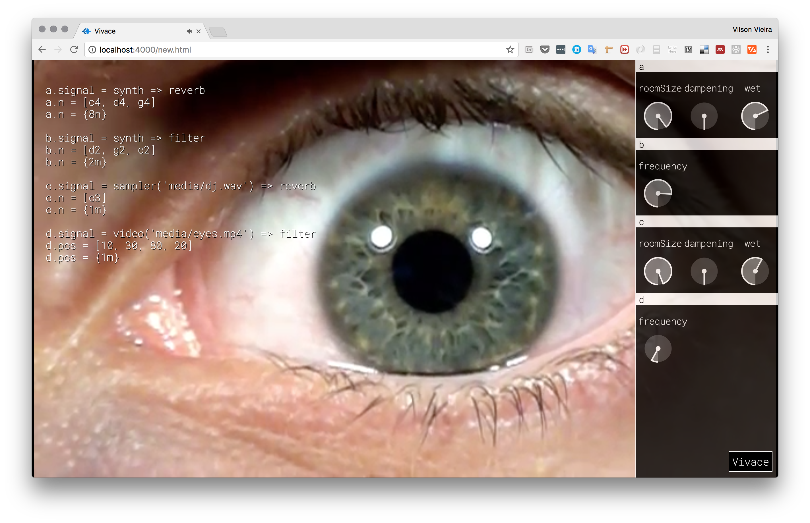

# Introduction

*Vivace* is a live coding DSL (Domain Specific Language) that runs on top of
the [Web
 Audio
 API](https://dvcs.w3.org/hg/audio/raw-file/tip/webaudio/specification.html)
 for audio processing and HTML5 Video for video displaying and control. The
 language parser and lexer are built using [Jison](http://jison.org) and
 [Tone.js](http://tonejs.github.io) is the framework of choice to handle
 audio processing and event scheduling synced with Web Audio API's internal clock.

*Vivace* aims to be easy to learn and use by providing a set of features:
- Simple syntax and grammar rules
- Runs on every popular browser, so newcomers to live coding can start
  practicing it right way
- Use native Web Audio API (abstracted by Tone.js), so it evolves together with
  the standards
- Mixes audio and video capabilities making it a Swiss knife for live playing
  of multimedia
- Full control of audio nodes and their parameters by language instructions or UI

[Try vivace](http://automata.github.io/vivace/new.html).

## OK, but what is live coding?

[Live coding](http://toplap.org) is an alternative way to compose and
play music (or other media) in real-time.  The performer/composer
plays on a computer device and shows your screen to the public, making
them part of the performance and at the same time demystifying what
the musician is really doing to generate that weird sounds. Live
coders commonly use general domain languages or create their own
computer music languages.

# The language

*Vivace* is based on a declarative paradigm: you tell __which params__ you want to
change from a __voice__; what their new __values__ are going to be; and for __how long__ the values are going last.
That's it.

For example, that's a "Hello, world!" in *Vivace*:

    a.signal = synth
    a.notes = [d4, e4, c4]
    a.notes = {1m}

Where `a` is the name of some __voice__. Every __voice__ has a __signal__ param
that defines voice's timbre. In this example that's a simple monophonic
synthesizer. Another default param is __notes__. Every param accepts two types
of lists: __values__ and __durations__. In this case, the list of values `[d4,
e4, c4]` will be played in order every one measure, defined by the list of
durations `[1m]`.

Try to type the example above and press `CTRL+x` to evaluate it. Also, try to
change the values and press `CTRL+x` again and again. That's the essence of
live coding: you're manipulating media on-the-fly.

## Voices

A __voice__ can be any name, like `a`, `b`, `foo`, `drum303`. You don't need to
declare a __voice__, just use it while defining a signal and it will be
automatically created.

## Signals

Every __voice__ has a default parameter that must be set before anything else:
the __signal__. You can't play a voice without having an instrument, right?
Just define a __signal__ using the chain operator `=>` and the names of the
__audio nodes__ you want to chain together:

    a.signal = synth => filter => reverb

In this example you are creating a monophonic synthesizer, plugging it to a
filter and then to a reverb. You can try other chains like:

    a.signal = sampler('media/bass.wav') => reverb
    b.signal = video('media/eyes.mp4') => filter

Note that some audio nodes in a chain can have parameters like the name of an
audio file to be used on `sampler`.

## Parameters: values, notes and durations

After you have your __signal__ defined for you __voice__, you are free to
automate every parameter of audio nodes that are part of the chain/signal.
Just point the name of the audio node and the name of the parameter you want to
change its values:

    a.filter.frequency = [300, 450]
    a.filter.frequency = {4n, 8n}

In this example we are changing the `frequency` of the `filter` audio node. We
do that using __values__ and __durations__ lists:

- __Values__ are lists
  delimited by `[` and `]` and their values can be numbers (for frequencies in Hz, or seconds for
  video positions, etc),
  musical notes in `note octave` format like `c4` or `g2`, and even degrees into
  a music scale like `ii, iii, iv`.

- __Durations__ are lists
  delimited by `{` and `}` and their values can be numbers (for seconds) and time
  expressions relative to BPM and time signatures like `1m` (one whole measure), `4n` (one quarter note)
  or `8t` (an eighth note).

## Using scales

Instead of specifying individual notes, it's posible to define a scale for a
voice and then use degrees to play notes into the scale:

    a.sig = synth
    a.scale = young-lm_piano   // Loads LaMonte Young's Well-Tempered Piano scale
    a.root = c4
    a.notes = [i, iii, v]
    a.notes = {4n}

It's convenient to specify the root of the scale to make degrees relative to
it. Scale degrees should be specified using Roman numbers (e.g. i, ii, iii, etc).

*Vivace* uses [TuneJS](https://github.com/abbernie/tune) to handle scales. For a complete list of available
scales, please [check this Web page](http://abbernie.github.io/tune/scales.html).

## Controling videos

Videos can be manipulated by defining __video__ as a node into a signal chain:

    foo.signal = video('media/eyes.mp4')
    foo.pos = [10, 20]
    foo.pos = {8n}

Videos accept __pos__ as a default parameter which specifies at what position
(in seconds) video should start playing. It also expects a duration list,
specifying the duration of it. Video playing is synced with Web Audio API's
internal clock, so both audio and video playing are in sync.

It is possible to route audio stream from videos through audio chains like we
do with any audio node. Just route it with the chain operator `=>`:

    foo.signal = video('media/eyes.mp4') => reverb => filter

## UI

To toggle UI controls, click on the *Vivace* banner on bottom right of the
screen. Click again whenever you want to hide it.

Everytime you create a new __voice__, a UI panel with controllers will be
created on *Vivace*'s drawer (the panel on the right).

When you change some parameter of a voice using the UI, the automations
previously defined for it are canceled, so you'll be in manual control of the
parameter by UI only. If you decide to evaluate the automations again, the
control will be passed to the automations as expected.

# Developing Vivace

To change grammar/lexer, change `vivace.jison` and `vivace.jisonlex`,
respectively, and:

    npm install jison -g
    jison vivace.jison vivace.jisonlex -o vivace.js
